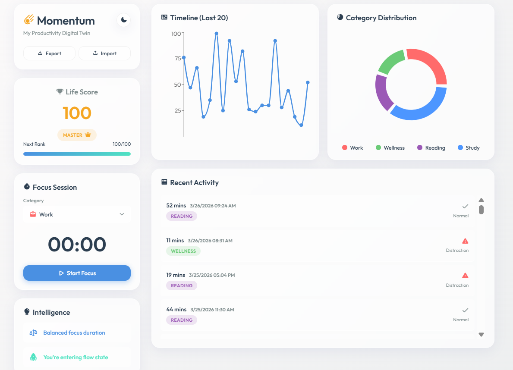

<div align="center">
  <h1>☄️ Momentum</h1>
  <p><strong>Your Productivity Digital Twin</strong></p>
  <p>A beautiful personal dashboard for tracking, visualizing, and analyzing your daily productivity and life score.</p>
</div>

---

## Overview

**Momentum** is a visually stunning, modern single-page application (SPA) built with React and Vite. It serves as a "Digital Twin" for your productivity, allowing you to log daily activities, calculate your "Life Score", and gain deeper insights into how you spend your time through beautiful, interactive charts.

## 🛠 Tech Stack

- **Framework:** React 18
- **Build Tool:** Vite
- **Charting Library:** Recharts
- **Styling:** Vanilla CSS (CSS Variables, Flexbox, Grid, Glassmorphism UI)
- **Icons:** Phosphor Icons

## Getting Started

Follow these simple steps to run the project locally on your machine.

### Prerequisites

Make sure you have [Node.js](https://nodejs.org/) installed on your system.

### Installation

1. **Clone the repository:**
   ```bash
   git clone https://github.com/Nhat-Hieu/Momentum.git
   ```

2. **Navigate to the project directory:**
   ```bash
   cd Momentum
   ```

3. **Install dependencies:**
   ```bash
   npm install
   ```

4. **Start the development server:**
   ```bash
   npm run dev
   ```

## Project Structure

```text
Momentum/
├── public/              
├── src/
│   ├── components/       
│   ├── hooks/            
│   ├── utils/            
│   ├── App.jsx          
│   ├── index.css         
│   └── main.jsx          
├── index.html            
├── package.json          
└── vite.config.js       
```

## Screenshots



## Contributing

Feel free to fork this project, submit pull requests, or send suggestions! 

---
<div align="center">
  <i>Built with ❤️ by Hieu</i>
</div>
